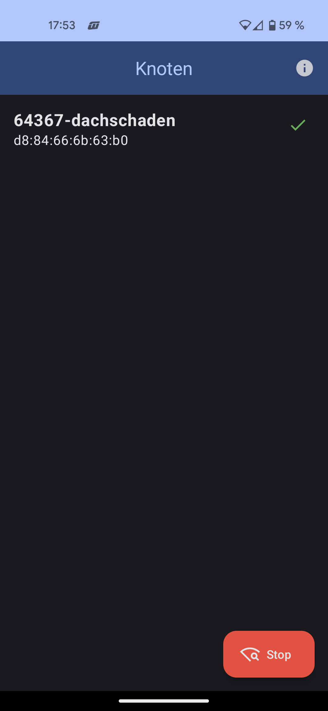
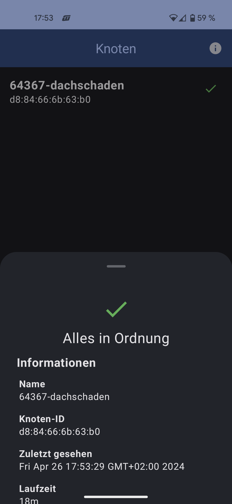
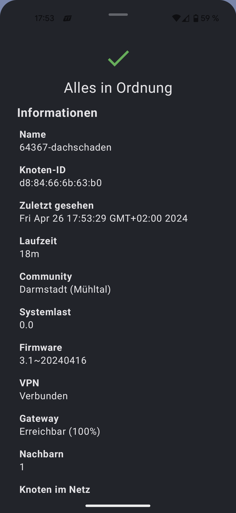

# NodeMonitor

NodeMonitor is an Android App to help diagnose Issues with Freifunk Nodes. Nodes need to have [ffda-node-whisperer](https://github.com/freifunk-gluon/community-packages/tree/master/ffda-node-whisperer) installed and the App will then show all Nodes in Range sending out those Beacon Frames.
There doesn't have to be a connection established to the Network.

## Screenshots

## Get It

- <a href="https://play.google.com/store/apps/details?id=net.freifunk.darmstadt.nodewhisperer">Google Play</a>
